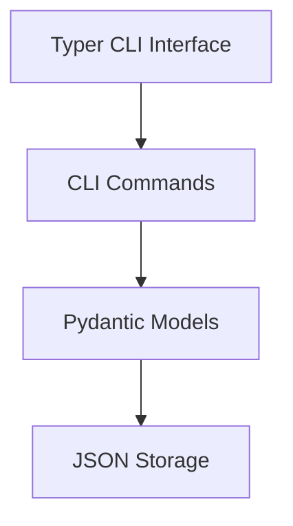

# System Architecture

## a. System Architecture

The system is a CLI-based TODO application built with Python. It leverages `Typer` for the CLI interface, `Pydantic` for data validation and modeling, and local file storage (JSON) for data persistence.



**Technology Selection Rationale:**
- **Typer**: Enables rapid development of intuitive and standard-compliant CLI applications.
- **Pydantic**: Provides robust data validation and schema definition, ensuring data integrity.
- **JSON Storage**: A simple, human-readable file format that perfectly suits a lightweight local CLI application without the overhead of a relational database.

**External Services:**
None.

## b. Shared Domain Models

Schemas must be strictly placed in `src/domain_models/` and exported via `src/domain_models/__init__.py`.

```python
# src/domain_models/todo.py
from enum import Enum
from datetime import datetime
from pydantic import BaseModel, Field, ConfigDict

class Priority(str, Enum):
    LOW = "low"
    MEDIUM = "medium"
    HIGH = "high"

class Status(str, Enum):
    PENDING = "pending"
    COMPLETED = "completed"

class TodoItem(BaseModel):
    model_config = ConfigDict(extra='forbid')

    id: int
    title: str = Field(..., min_length=1)
    description: str | None = None
    priority: Priority = Priority.MEDIUM
    status: Status = Status.PENDING
    due_date: datetime | None = None
```

## c. Cycle Map

| Cycle | Artifacts (Files/Classes) | Provided Interface | Dependent Cycle |
|-------|------------------------|---------------------|-----------|
| CYCLE01 | `src/domain_models/todo.py`, `src/todo/storage.py`, `src/todo/cli.py` | Basic CRUD CLI commands (`add`, `list`, `complete`, `delete`), JSON storage access | - |
| CYCLE02 | `src/todo/cli.py`, `src/todo/storage.py` | Search, filter, edit commands, enhanced storage queries | CYCLE01 |

## d. Integration Test Master Plan

| # | Merge Target | Test File | Validation Scenario | Execution Timing |
|---|----------|-------------|------------|-------------|
| IT01 | CYCLE01 + CYCLE02 | `tests/integration/test_storage_integration.py` | Verify that filtering and searching work correctly across a dynamically populated JSON storage using the implemented CLI commands and storage queries. | Phase 3 |
| IT02 | ALL | `tests/integration/test_e2e.py` | End-to-end execution of adding, editing, completing, filtering, and deleting TODO items via the CLI, asserting final JSON storage state. | Phase 3 Completion |
